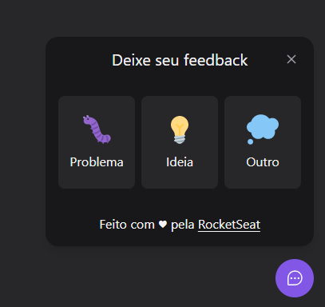
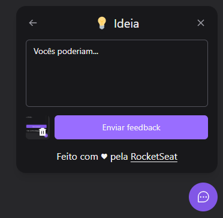
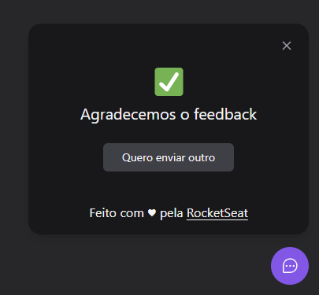

# Ferramenta de Feedback





Link da aplicação: <a target="_blank" href="https://jgsl-cms.netlify.app/">https://jgsl-nlw.netlify.app/
</a>

### 💼 Ajustes e alterações

> O projeto foi finalizado.

- [x] Instalação das dependências
- [x] Componente Widget
- [x] Componente WidgetForm 
- [x] Componente CloseButton e Componente Loading
- [x] Uso de estados para verificar em qual etapa o usuário está
- [x] Comunicação por Props entre componentes

### 📁 Principais componentes do projeto

- **Widget**: após a ativação desse Widget, o componente 'FeedbackType' será exposto.
- **FeedbackType**: usuário poderá escolher qual tipo de feedback enviará.
- **FeedbackContent**: formulário para enviar o feedback, podendo tirar print da tela.
- **FeedbackSuccess**: mensagem de sucesso do envio do formulário.

### 👨‍💻 Tecnologias
Tecnologias usadas no projeto:

<ul>
    <li>HTML</li>
    <li>TailwindCSS</li>
    <li>TypeScript</li>
    <li>ReactJS</li>
    <li>Phosphor React</li>
</ul>

### 💼 Como o projeto funciona

O projeto consiste numa ferramenta de feedback para sites institucionais, e-commerces, landing pages ou sistemas.

### 🤝 Colaborador

<table>
  <tr>
    <td align="center">
      <a href="#">
        <br>
        <sub>
          <b>João Guilherme</b>
        </sub>
      </a>
    </td>
  </tr>
</table>

### :closed_book: Requisitos ##

Depois de iniciar :checkered_flag:, você precisa ter o  [Git](https://git-scm.com) e o [Node](https://nodejs.org/en/) instalados.

## :checkered_flag: Iniciar ##

```bash
# Clonar o projeto
$ git clone https://github.com/jguilhermesl/nlw-project
# Acesse
$ cd nlw-project
# Instalar dependências
$ yarn ou npm 
# Rodar o projeto
$ npm run dev ou yarn dev
# O servidor será inicializado em <http://localhost:3000>
```
